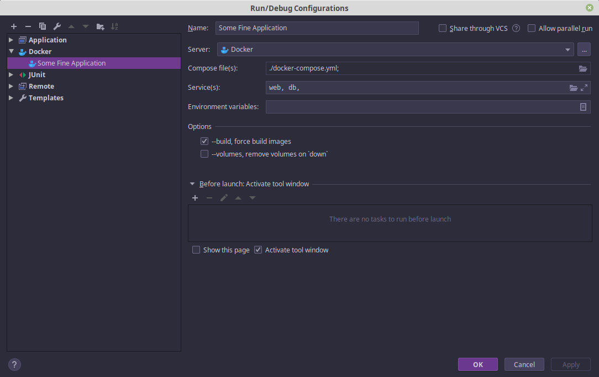
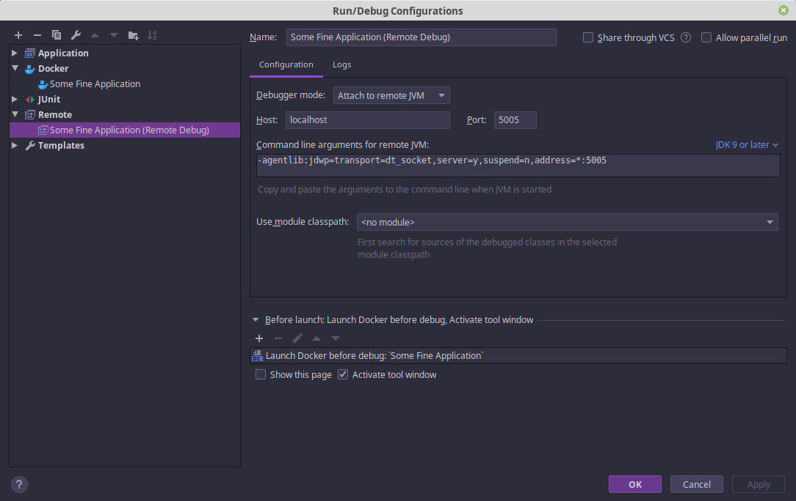
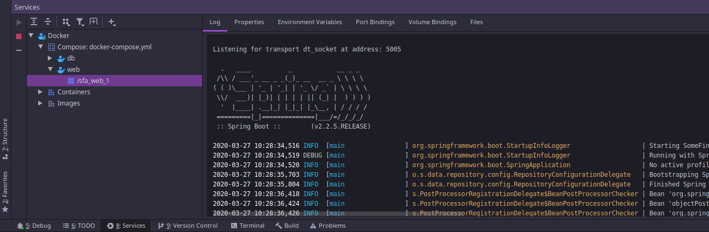

# Docker and IntelliJ

Assuming the Docker plugin for IntelliJ is already installed.

## Create a Docker Run Configuration

 - Create a run configuration for Docker
 - Select the `docker-compose.yml` file from the project root directory
 - Select the services, here it is `web` and `db` from the compose file
 - Check the `--build` option if you want to force a new build image every time you deploy



## Create a Remote Debug Run Configuration

 - Create a run configuration for a Remote debugger
 - Note the `Command line arguments for remote JVM`
 - In the `Before launch` section, choose the previously created Docker Run Configuration
 
Where IntelliJ shows the command line arguments for the Remove JVM, this is informational - IntelliJ will not set those
options for you. You have to specify those options with your Docker entry-point:

```
# Start the application.
ENTRYPOINT ["java", "-agentlib:jdwp=transport=dt_socket,server=y,suspend=n,address=*:5005", "-jar", "sfa.jar"]
```

You can tailor the port numbers however you need them, here the default `5005` is used.



## Deploy the containers

Use the `8: Services` tab to see the Docker server UI.

You can run the Docker Run Configuration to deploy the containers.

Click on the `/web/sfa_web_1` item in the Docker server tree and it will show the container log.

At the start of the log you should see "Listenting for transport dt_socket at address: 5005":



## Launch the debugger

Run the Remote Run Configuration previously created.

## Summary

It actually works!

You can use the same services tab to stop or tear down the deployment.
